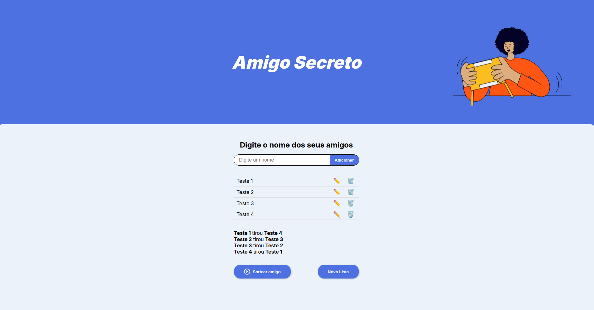

# Amigo Secreto
Este projeto foi desenvolvido durante o programa Oracle Next Education em parceria com a Alura, tendo como objetivo implementar a lógica em JavaScript para um site de Amigo Secreto, utilizando conhecimentos adquiridos nos cursos:

- Lógica de programação: mergulhe em programação com JavaScript
- Lógica de programação: explore funções e listas
- Git e GitHub: compartilhando e colaborando em projetos

---

## Funcionalidades

- Adicionar nomes dos participantes.
- Exibir a lista dos amigos adicionados.
- Sortear os amigos secretos de forma aleatória, garantindo que ninguém tire a si mesmo.
- Limpar a lista e começar um novo sorteio.
- Interface intuitiva e responsiva, com design moderno e acessível.

---

## Capturas de tela

### Tela inicial com lista vazia


### Lista de amigos com adicionados


### Resultado do sorteio



---

## Demonstração em vídeo


[]

---

## Como usar

1. Abra o arquivo `index.html` em seu navegador.
2. No campo de texto, digite o nome de um amigo e clique no botão **Adicionar**.
3. Repita até adicionar todos os participantes.
4. Clique em **Sortear amigo** para realizar o sorteio.
5. Visualize o resultado na tela.
6. Para começar uma nova lista, clique em **Nova Lista**.

---

## Instalação

Não requer instalação complexa! Basta clonar este repositório ou baixar os arquivos e abrir o `index.html` no navegador.

```bash
git clone https://github.com/seuusuario/amigo-secreto.git
cd amigo-secreto
open index.html  # ou abra diretamente no navegador
